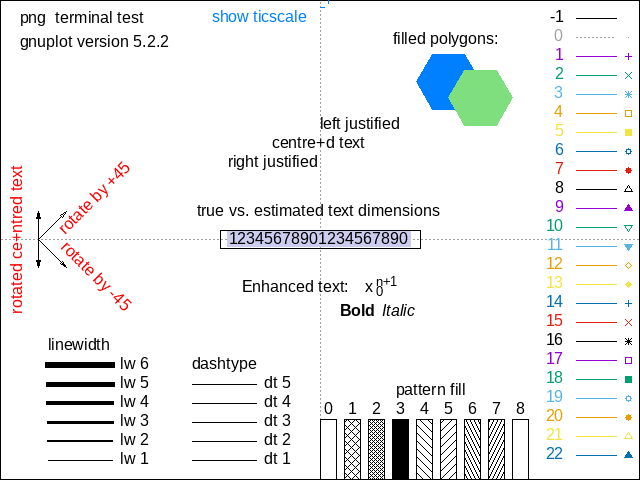
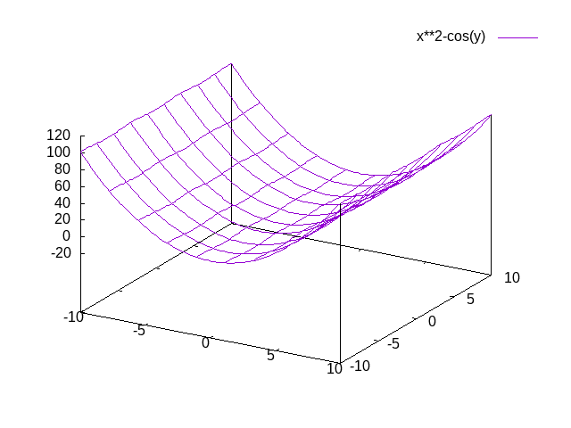
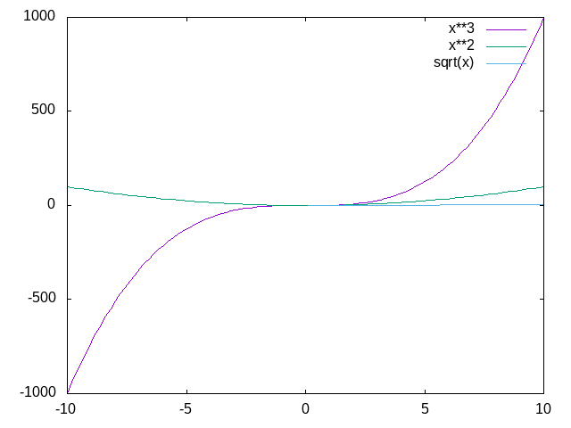

.. code:: spad

    )version

.. parsed-literal::

    Value = "FriCAS 2021-03-06 compiled at Mi Mär 31 16:01:42 CEST 2021"

.. code:: spad

    )! gnuplot -e "set term png; test"

.. code:: spad

    output "<html>x+2</html>"

.. raw:: html

    <html>x+2</html>--FORMAT:BEG:Type:1
                                                                       Type: Void
    --FORMAT:END:Type:1
    --FORMAT:BEG:Storage:1
                             Storage: 0 (IN) + 0 (EV) + 0 (OT) + 0 (GC) = 0 bytes
    --FORMAT:END:Storage:1
    

.. code:: spad

    )! gnuplot -e "set term png; splot x**2-cos(y)"

.. code:: spad

    base64_data:="iVBORw0KGgo.....<deleted to save space!>.....TkSuQmCC" 

.. parsed-literal::

    "iVBORw0KGgo.....<deleted to save space!>.....TkSuQmCC"

.. raw:: html

    
<a href="https://fricas.github.io/api/String.html" target="_blank" style="color:blue;text-decoration:none;">String</a>

.. code:: spad

    )! gnuplot -e "set term postscript; splot x**2-y**2"

.. code:: spad

    a

.. parsed-literal::

    a

.. raw:: html

    
<a href="https://fricas.github.io/api/Variable.html" target="_blank" style="color:blue;text-decoration:none;">Variable</a>(a)

.. code:: spad

    )! gnuplot -e "set term png; plot x**3,x**2,sqrt(x)"

.. code:: spad

    quickLoad "draw"

.. code:: spad

    )! ls ~/quicklisp/local-projects/spadlib/

.. parsed-literal::

    aosc
    awaic
    codata
    dform
    docs
    extcalc
    fmtmjax
    fripac.sh
    gle
    idxobj
    lagmech
    LICENSE
    ltxpv
    oobj
    pform
    pipe
    pltspt
    pqty
    pullback
    quicklsp
    ratival
    README
    README.md
    strspt
    supargs
    system-index.txt
    tensalg
    tex
    tmspt
    trivsh
    webclient
    webspad

.. code:: spad

    )! gnuplot -e "set term svg; plot x"

.. parsed-literal::

    <?xml version="1.0" encoding="utf-8"  standalone="no"?>
    <svg 
     width="600" height="480"
     viewBox="0 0 600 480"
     xmlns="http://www.w3.org/2000/svg"
     xmlns:xlink="http://www.w3.org/1999/xlink"
    >
    
    <title>Gnuplot</title>
    <desc>Produced by GNUPLOT 5.2 patchlevel 2 </desc>
    
    <g id="gnuplot_canvas">
    
    <rect x="0" y="0" width="600" height="480" fill="none"/>
    <defs>
    
    	<circle id='gpDot' r='0.5' stroke-width='0.5'/>
    	<path id='gpPt0' stroke-width='0.222' stroke='currentColor' d='M-1,0 h2 M0,-1 v2'/>
    	<path id='gpPt1' stroke-width='0.222' stroke='currentColor' d='M-1,-1 L1,1 M1,-1 L-1,1'/>
    	<path id='gpPt2' stroke-width='0.222' stroke='currentColor' d='M-1,0 L1,0 M0,-1 L0,1 M-1,-1 L1,1 M-1,1 L1,-1'/>
    	<rect id='gpPt3' stroke-width='0.222' stroke='currentColor' x='-1' y='-1' width='2' height='2'/>
    	<rect id='gpPt4' stroke-width='0.222' stroke='currentColor' fill='currentColor' x='-1' y='-1' width='2' height='2'/>
    	<circle id='gpPt5' stroke-width='0.222' stroke='currentColor' cx='0' cy='0' r='1'/>
    	<use xlink:href='#gpPt5' id='gpPt6' fill='currentColor' stroke='none'/>
    	<path id='gpPt7' stroke-width='0.222' stroke='currentColor' d='M0,-1.33 L-1.33,0.67 L1.33,0.67 z'/>
    	<use xlink:href='#gpPt7' id='gpPt8' fill='currentColor' stroke='none'/>
    	<use xlink:href='#gpPt7' id='gpPt9' stroke='currentColor' transform='rotate(180)'/>
    	<use xlink:href='#gpPt9' id='gpPt10' fill='currentColor' stroke='none'/>
    	<use xlink:href='#gpPt3' id='gpPt11' stroke='currentColor' transform='rotate(45)'/>
    	<use xlink:href='#gpPt11' id='gpPt12' fill='currentColor' stroke='none'/>
    	<path id='gpPt13' stroke-width='0.222' stroke='currentColor' d='M0,1.330 L1.265,0.411 L0.782,-1.067 L-0.782,-1.076 L-1.265,0.411 z'/>
    	<use xlink:href='#gpPt13' id='gpPt14' fill='currentColor' stroke='none'/>
    	<filter id='textbox' filterUnits='objectBoundingBox' x='0' y='0' height='1' width='1'>
    	  <feFlood flood-color='white' flood-opacity='1' result='bgnd'/>
    	  <feComposite in='SourceGraphic' in2='bgnd' operator='atop'/>
    	</filter>
    	<filter id='greybox' filterUnits='objectBoundingBox' x='0' y='0' height='1' width='1'>
    	  <feFlood flood-color='lightgrey' flood-opacity='1' result='grey'/>
    	  <feComposite in='SourceGraphic' in2='grey' operator='atop'/>
    	</filter>
    </defs>
    <g fill="none" color="white" stroke="currentColor" stroke-width="1.00" stroke-linecap="butt" stroke-linejoin="miter">
    </g>
    <g fill="none" color="black" stroke="currentColor" stroke-width="1.00" stroke-linecap="butt" stroke-linejoin="miter">
    	<path stroke='black'  d='M45.6,444.0 L54.6,444.0 M575.0,444.0 L566.0,444.0  '/>	<g transform="translate(37.3,447.9)" stroke="none" fill="black" font-family="Arial" font-size="12.00"  text-anchor="end">
    		<text><tspan font-family="Arial" >-10</tspan></text>
    	</g>
    </g>
    <g fill="none" color="black" stroke="currentColor" stroke-width="1.00" stroke-linecap="butt" stroke-linejoin="miter">
    	<path stroke='black'  d='M45.6,337.5 L54.6,337.5 M575.0,337.5 L566.0,337.5  '/>	<g transform="translate(37.3,341.4)" stroke="none" fill="black" font-family="Arial" font-size="12.00"  text-anchor="end">
    		<text><tspan font-family="Arial" >-5</tspan></text>
    	</g>
    </g>
    <g fill="none" color="black" stroke="currentColor" stroke-width="1.00" stroke-linecap="butt" stroke-linejoin="miter">
    	<path stroke='black'  d='M45.6,231.0 L54.6,231.0 M575.0,231.0 L566.0,231.0  '/>	<g transform="translate(37.3,234.9)" stroke="none" fill="black" font-family="Arial" font-size="12.00"  text-anchor="end">
    		<text><tspan font-family="Arial" > 0</tspan></text>
    	</g>
    </g>
    <g fill="none" color="black" stroke="currentColor" stroke-width="1.00" stroke-linecap="butt" stroke-linejoin="miter">
    	<path stroke='black'  d='M45.6,124.6 L54.6,124.6 M575.0,124.6 L566.0,124.6  '/>	<g transform="translate(37.3,128.5)" stroke="none" fill="black" font-family="Arial" font-size="12.00"  text-anchor="end">
    		<text><tspan font-family="Arial" > 5</tspan></text>
    	</g>
    </g>
    <g fill="none" color="black" stroke="currentColor" stroke-width="1.00" stroke-linecap="butt" stroke-linejoin="miter">
    	<path stroke='black'  d='M45.6,18.1 L54.6,18.1 M575.0,18.1 L566.0,18.1  '/>	<g transform="translate(37.3,22.0)" stroke="none" fill="black" font-family="Arial" font-size="12.00"  text-anchor="end">
    		<text><tspan font-family="Arial" > 10</tspan></text>
    	</g>
    </g>
    <g fill="none" color="black" stroke="currentColor" stroke-width="1.00" stroke-linecap="butt" stroke-linejoin="miter">
    	<path stroke='black'  d='M45.6,444.0 L45.6,435.0 M45.6,18.1 L45.6,27.1  '/>	<g transform="translate(45.6,465.9)" stroke="none" fill="black" font-family="Arial" font-size="12.00"  text-anchor="middle">
    		<text><tspan font-family="Arial" >-10</tspan></text>
    	</g>
    </g>
    <g fill="none" color="black" stroke="currentColor" stroke-width="1.00" stroke-linecap="butt" stroke-linejoin="miter">
    	<path stroke='black'  d='M178.0,444.0 L178.0,435.0 M178.0,18.1 L178.0,27.1  '/>	<g transform="translate(178.0,465.9)" stroke="none" fill="black" font-family="Arial" font-size="12.00"  text-anchor="middle">
    		<text><tspan font-family="Arial" >-5</tspan></text>
    	</g>
    </g>
    <g fill="none" color="black" stroke="currentColor" stroke-width="1.00" stroke-linecap="butt" stroke-linejoin="miter">
    	<path stroke='black'  d='M310.3,444.0 L310.3,435.0 M310.3,18.1 L310.3,27.1  '/>	<g transform="translate(310.3,465.9)" stroke="none" fill="black" font-family="Arial" font-size="12.00"  text-anchor="middle">
    		<text><tspan font-family="Arial" > 0</tspan></text>
    	</g>
    </g>
    <g fill="none" color="black" stroke="currentColor" stroke-width="1.00" stroke-linecap="butt" stroke-linejoin="miter">
    	<path stroke='black'  d='M442.7,444.0 L442.7,435.0 M442.7,18.1 L442.7,27.1  '/>	<g transform="translate(442.7,465.9)" stroke="none" fill="black" font-family="Arial" font-size="12.00"  text-anchor="middle">
    		<text><tspan font-family="Arial" > 5</tspan></text>
    	</g>
    </g>
    <g fill="none" color="black" stroke="currentColor" stroke-width="1.00" stroke-linecap="butt" stroke-linejoin="miter">
    	<path stroke='black'  d='M575.0,444.0 L575.0,435.0 M575.0,18.1 L575.0,27.1  '/>	<g transform="translate(575.0,465.9)" stroke="none" fill="black" font-family="Arial" font-size="12.00"  text-anchor="middle">
    		<text><tspan font-family="Arial" > 10</tspan></text>
    	</g>
    </g>
    <g fill="none" color="black" stroke="currentColor" stroke-width="1.00" stroke-linecap="butt" stroke-linejoin="miter">
    </g>
    <g fill="none" color="black" stroke="currentColor" stroke-width="1.00" stroke-linecap="butt" stroke-linejoin="miter">
    	<path stroke='black'  d='M45.6,18.1 L45.6,444.0 L575.0,444.0 L575.0,18.1 L45.6,18.1 Z  '/></g>
    <g fill="none" color="black" stroke="currentColor" stroke-width="1.00" stroke-linecap="butt" stroke-linejoin="miter">
    </g>
    	<g id="gnuplot_plot_1" ><title>x</title>
    <g fill="none" color="black" stroke="currentColor" stroke-width="1.00" stroke-linecap="butt" stroke-linejoin="miter">
    	<g transform="translate(507.9,40.0)" stroke="none" fill="black" font-family="Arial" font-size="12.00"  text-anchor="end">
    		<text>x</text>
    	</g>
    </g>
    <g fill="none" color="black" stroke="currentColor" stroke-width="1.00" stroke-linecap="butt" stroke-linejoin="miter">
    	<path stroke='rgb(148,   0, 211)'  d='M516.2,36.1 L558.4,36.1 M45.6,444.0 L50.9,439.7 L56.3,435.4 L61.6,431.1 L67.0,426.8 L72.3,422.5
    		L77.7,418.2 L83.0,413.9 L88.4,409.6 L93.7,405.3 L99.1,401.0 L104.4,396.7 L109.8,392.4 L115.1,388.1
    		L120.5,383.8 L125.8,379.5 L131.2,375.2 L136.5,370.9 L141.9,366.6 L147.2,362.3 L152.5,358.0 L157.9,353.7
    		L163.2,349.4 L168.6,345.1 L173.9,340.8 L179.3,336.4 L184.6,332.1 L190.0,327.8 L195.3,323.5 L200.7,319.2
    		L206.0,314.9 L211.4,310.6 L216.7,306.3 L222.1,302.0 L227.4,297.7 L232.8,293.4 L238.1,289.1 L243.5,284.8
    		L248.8,280.5 L254.2,276.2 L259.5,271.9 L264.8,267.6 L270.2,263.3 L275.5,259.0 L280.9,254.7 L286.2,250.4
    		L291.6,246.1 L296.9,241.8 L302.3,237.5 L307.6,233.2 L313.0,228.9 L318.3,224.6 L323.7,220.3 L329.0,216.0
    		L334.4,211.7 L339.7,207.4 L345.1,203.1 L350.4,198.8 L355.8,194.5 L361.1,190.2 L366.4,185.9 L371.8,181.6
    		L377.1,177.3 L382.5,173.0 L387.8,168.7 L393.2,164.4 L398.5,160.1 L403.9,155.8 L409.2,151.5 L414.6,147.2
    		L419.9,142.9 L425.3,138.6 L430.6,134.3 L436.0,130.0 L441.3,125.7 L446.7,121.3 L452.0,117.0 L457.4,112.7
    		L462.7,108.4 L468.1,104.1 L473.4,99.8 L478.7,95.5 L484.1,91.2 L489.4,86.9 L494.8,82.6 L500.1,78.3
    		L505.5,74.0 L510.8,69.7 L516.2,65.4 L521.5,61.1 L526.9,56.8 L532.2,52.5 L537.6,48.2 L542.9,43.9
    		L548.3,39.6 L553.6,35.3 L559.0,31.0 L564.3,26.7 L569.7,22.4 L575.0,18.1  '/></g>
    	</g>
    <g fill="none" color="white" stroke="rgb(148,   0, 211)" stroke-width="2.00" stroke-linecap="butt" stroke-linejoin="miter">
    </g>
    <g fill="none" color="black" stroke="currentColor" stroke-width="2.00" stroke-linecap="butt" stroke-linejoin="miter">
    </g>
    <g fill="none" color="black" stroke="black" stroke-width="1.00" stroke-linecap="butt" stroke-linejoin="miter">
    </g>
    <g fill="none" color="black" stroke="currentColor" stroke-width="1.00" stroke-linecap="butt" stroke-linejoin="miter">
    	<path stroke='black'  d='M45.6,18.1 L45.6,444.0 L575.0,444.0 L575.0,18.1 L45.6,18.1 Z  '/></g>
    <g fill="none" color="black" stroke="currentColor" stroke-width="1.00" stroke-linecap="butt" stroke-linejoin="miter">
    </g>
    </g>
    </svg>
    

.. code:: spad

    )! ls */*.png

.. parsed-literal::

    units-2.18/icon_ms.png

.. code:: spad

    )! cat units-2.18/icon_ms.png

.. code:: spad

    )ipysh dir()

.. parsed-literal::

    ['BytesIO', 'In', 'Out', '_', '_1', '__', '___', '__builtin__', '__builtins__', '__doc__', '__loader__', '__name__', '__package__', '__spec__', '_dh', '_ih', '_oh', '_to_png', 'base64', 'exit', 'f', 'get_ipython', 'np', 'plt', 'quit', 'show', 'urllib']

.. code:: spad

    )ipysh
    def f(x): return(x+2)

.. parsed-literal::

    None

.. code:: spad

    )ipysh f(8)

.. parsed-literal::

    10

.. code:: spad

    )mplot

.. code:: spad

    )ipysh import flint

.. parsed-literal::

    None

.. code:: spad

    )ipysh dir(flint)

.. parsed-literal::

    ['FlintContext', '__builtins__', '__doc__', '__file__', '__goodness', '__loader__', '__name__', '__package__', '__pyx_unpickle_FlintContext', '__pyx_unpickle_IntegrationContext', '__pyx_unpickle_flint_elem', '__pyx_unpickle_flint_mat', '__pyx_unpickle_flint_poly', '__pyx_unpickle_flint_scalar', '__pyx_unpickle_flint_series', '__pyx_unpickle_nmod_series', '__spec__', '__test__', 'acb', 'acb_mat', 'acb_poly', 'acb_series', 'arb', 'arb_mat', 'arb_poly', 'arb_series', 'arf', 'ctx', 'dirichlet_char', 'dirichlet_group', 'flint_elem', 'flint_mat', 'flint_poly', 'flint_scalar', 'flint_series', 'fmpq', 'fmpq_mat', 'fmpq_poly', 'fmpq_series', 'fmpz', 'fmpz_mat', 'fmpz_poly', 'fmpz_series', 'good', 'nmod', 'nmod_mat', 'nmod_poly', 'nmod_series', 'showgood']

